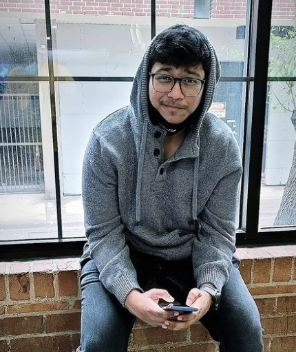

### data-dev
# Neelesh Saladi
## Current
Hi everyone! , I am Neelesh Saladi (Neel), I am in my Final semester of Masters in Applied Computer Science (ACS) at Northwest Missouri State University. I am very glad that I chose my studies at NWMSU as everyone is very good and interactive and I am preparing myself to be perfect at everything before leaving the NWMSU. 
## Background
I am from Hyderabad, Telangana, India. I had done my bachelor's in Information Technology as my major from SRM University, Chennai in the class of 2019. I like to travel a lot and explore every place to learn about people new culture and traditions, I want to start a blog where I’ll add all the information about the places I traveled, I click a lot of pictures, and my blog will have travel photography. In my free time I like to cook and watch many movies, TV shows, I also go for a Hike or a Trek once in a while.
## Plans
My current goal is to achieve a role as a frontend developer in MNC. Starting from this I’m planning my future to achieve my goals which I am aspiring from my childhood.

## Links

1. Linkedin (https://www.linkedin.com/in/neelesh-saladi-850461168) 

2. Portfolio ( https://neeleshsaladi.github.io/)

